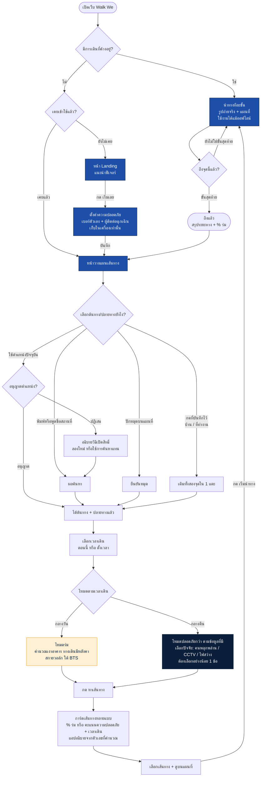
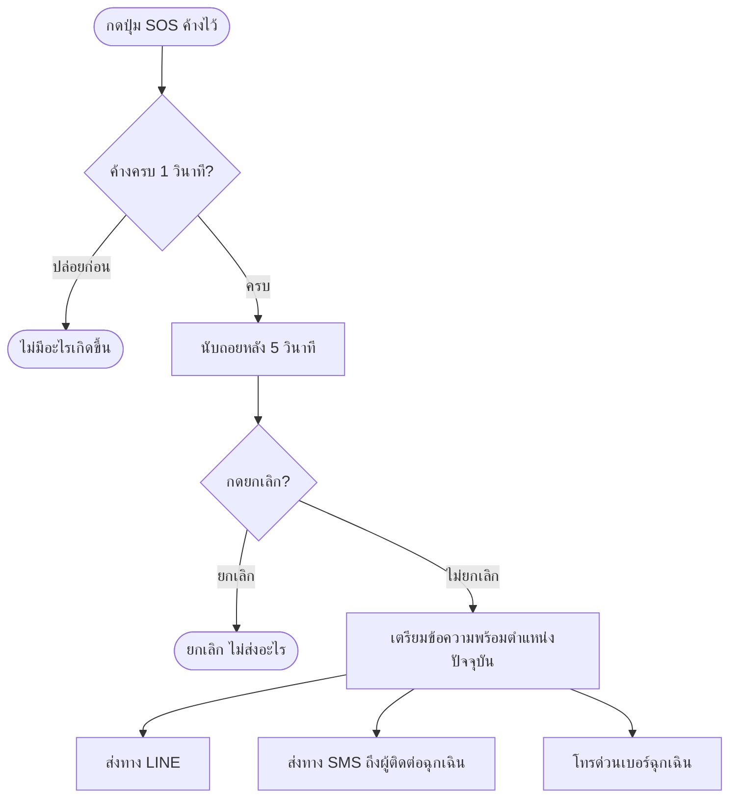
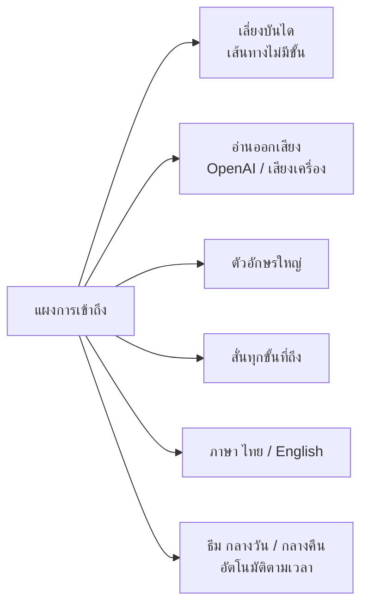

# Walk We — Flowchart การใช้งาน

## 1. ภาพรวมการใช้งาน (User Flow)

```mermaid
flowchart TD
    A([เปิดเว็บ Walk We]) --> B{มีการเดินที่ค้างอยู่?}
    B -- ใช่ --> NAV
    B -- ไม่ --> C{เคยเข้าใช้แล้ว?}

    C -- ยังไม่เคย --> L[หน้า Landing<br/>แนะนำฟีเจอร์]
    L -->|กด เริ่มเลย| S[ตั้งค่าความปลอดภัย<br/>เบอร์ตัวเอง + ผู้ติดต่อฉุกเฉิน<br/>เก็บในเครื่องเท่านั้น]
    C -- เคยแล้ว --> P

    S -->|บันทึก| P[หน้าวางแผนเส้นทาง]

    P --> Q{เลือกต้นทาง/ปลายทางยังไง?}
    Q -->|ใช้ตำแหน่งปัจจุบัน| G{อนุญาตตำแหน่ง?}
    Q -->|พิมพ์หรือพูดชื่อสถานที่| SR[ผลค้นหา]
    Q -->|ปักหมุดบนแผนที่| PIN[ยืนยันหมุด]
    Q -->|กดที่บันทึกไว้<br/>บ้าน / ที่ทำงาน| SV[เติมทั้งสองจุดใน 1 แตะ]

    G -- อนุญาต --> READY
    G -- ปฏิเสธ --> GH[อธิบายวิธีเปิดสิทธิ์<br/>ลองใหม่ หรือใช้การค้นหาแทน] --> SR
    SR --> READY
    PIN --> READY
    SV --> READY

    READY[ได้ต้นทาง + ปลายทางแล้ว] --> T[เลือกเวลาเดิน<br/>ตอนนี้ หรือ ตั้งเวลา]
    T --> M{โหมดตามเวลาเดิน}
    M -- กลางวัน --> DAY[โหมดร่ม<br/>คำนวณเงาอาคาร ทางเดินมีหลังคา<br/>สกายวอล์ก ใต้ BTS]
    M -- กลางคืน --> NIGHT[โหมดปลอดภัยกว่า ตามข้อมูลที่มี<br/>เลือกปัจจัย: คนพลุกพล่าน / CCTV / ไฟสว่าง<br/>ต้องเลือกอย่างน้อย 1 ข้อ]

    DAY --> F[กด หาเส้นทาง]
    NIGHT --> F
    F --> R[การ์ดเส้นทางหลายแบบ<br/>% ร่ม หรือ คะแนนความปลอดภัย + เวลาเดิน<br/>แอปอธิบายจากตัวเลขที่คำนวณ]
    R --> R2[เลือกเส้นทาง + ดูบนแผนที่]
    R2 -->|กด เริ่มนำทาง| NAV

    NAV[นำทางทีละขั้น<br/>รูปถ่ายจริง + แผนที่<br/>ใช้งานได้แม้ออฟไลน์] --> NX{ถึงจุดนี้แล้ว?}
    NX -- ยังไม่ใช่ขั้นสุดท้าย --> NAV
    NX -- ขั้นสุดท้าย --> END([ถึงแล้ว<br/>สรุประยะทาง + % ร่ม])
    END --> P

    classDef screen fill:#1E4FA8,stroke:#0B1F3A,color:#ffffff
    classDef sun fill:#FDF0D5,stroke:#F5A524,color:#0B1F3A
    classDef night fill:#0B1F3A,stroke:#0B1F3A,color:#ffffff
    class L,S,P,NAV screen
    class DAY sun
    class NIGHT night
```

## 2. SOS ฉุกเฉิน (อยู่บนหน้าวางแผนและหน้านำทาง)

```mermaid
flowchart TD
    A([กดปุ่ม SOS ค้างไว้]) --> B{ค้างครบ 1 วินาที?}
    B -- ปล่อยก่อน --> X([ไม่มีอะไรเกิดขึ้น])
    B -- ครบ --> C[นับถอยหลัง 5 วินาที]
    C --> D{กดยกเลิก?}
    D -- ยกเลิก --> Y([ยกเลิก ไม่ส่งอะไร])
    D -- ไม่ยกเลิก --> E[เตรียมข้อความพร้อมตำแหน่งปัจจุบัน]
    E --> F[ส่งทาง LINE]
    E --> G[ส่งทาง SMS ถึงผู้ติดต่อฉุกเฉิน]
    E --> H[โทรด่วนเบอร์ฉุกเฉิน]
```

## 3. ตัวช่วยการเข้าถึง (เปิดได้ตลอดจากแผงตั้งค่า)

```mermaid
flowchart LR
    A[แผงการเข้าถึง] --> B[เลี่ยงบันได<br/>เส้นทางไม่มีขั้น]
    A --> C[อ่านออกเสียง<br/>OpenAI / เสียงเครื่อง]
    A --> D[ตัวอักษรใหญ่]
    A --> E[สั่นทุกขั้นที่ถึง]
    A --> F[ภาษา ไทย / English]
    A --> G[ธีม กลางวัน / กลางคืน<br/>อัตโนมัติตามเวลา]
```
